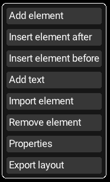

# Clayouter
## A GUI to build UIs

Clayouter is an application that aids in building UIs using [Clay](https://github.com/nicbarker/clay/). The application, of course, uses Clay for its own UI layout, so the UI you build at runtime is what is actually displayed. Once a page, component, etc., has been built, it can be exported as C code to be included in your application. The import element feature allows the user to import a component saved as Clay syntax, albeit with restrictions.

## Build
Clayouter uses CMake to build, or you could just build all the `.c` files and link it with raylib. However, CMake will fetch raylib if you don't have it installed on your system.

```
cmake -B build -S .
cmake --build build
```

## How to use
Make sure your working directory contains the `resources` directory, and run `./build/clayouter`. You will be greeted with a blank screen with only the root element. Right click to open the context menu. From here, you can add or import new elements and edit, export, or remove existing elements.


Adding a new element will open the properties window for the new element. From here you can change (almost) every parameter Clay has available.
*Note that the default sizing of* `CLAY__SIZING_FIT` *with a minimum size 0 means that the new element will not be visible, as it has no child elements to fit.*

### Export
When you have finished building your page or component, right click and select "Export layout", enter a filename, and export. The file will be written to your working directory. The output is not formatted much at all, so you may want to run it through clang-format or a similar tool.

### Import
Clayouter is able to import layouts saved in files with some restrictions including:
1. All values must be literals
No constant expressions, macros, etc.
2. Only Clay syntax is accepted
No inline C code such as `for` loops, functions, etc., and the file should contain only the layout you wish to import.
3. Ternary expressions are only available with `Clay_Hovered()` as the condition

The parser uses [stb_c_lexer](https://github.com/nothings/stb/blob/master/stb_c_lexer.h) to parse the input.

### Fonts
TrueType fonts can be added to the resources directory and will be available when building your UI. However, it is unlikely that the font IDs clayouter assigns your chosen fonts will be the same that you use in your application.

## License
This project is licensed under the terms of the MIT license.
It uses the following external libraries:
- [Clay](https://github.com/nicbarker/clay/) is used for UI layout, with a few minor modifications.
- [Raylib](https://github.com/raysan5/raylib) is used as the renderer
- [stb_c_lexer](https://github.com/nothings/stb/blob/master/stb_c_lexer.h) is used in the import feature
